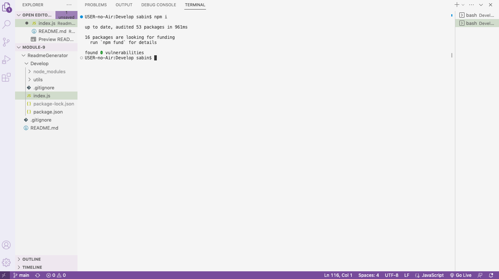
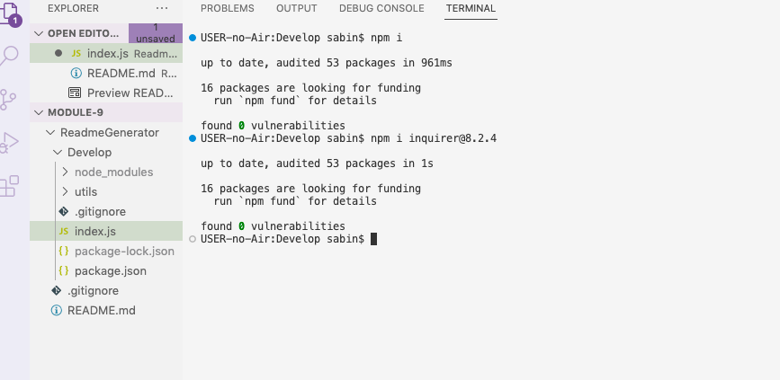
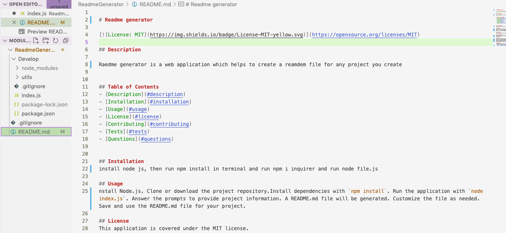
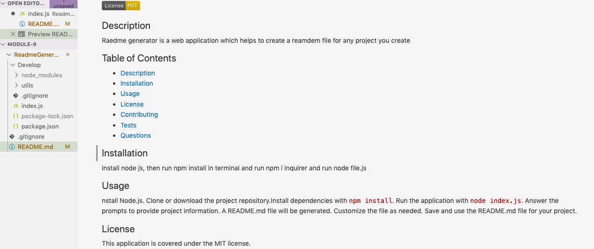

# Readme Generator

https://github.com/Saben1/ReadmeGenerator/assets/127642875/426a4dfb-d654-41a5-82ed-500bbfe34a6b

## Description

The "README Generator" is a command-line application that automates the creation of professional README.md files for software projects. By answering a series of prompts, users can generate a comprehensive README file with sections for project description, installation instructions, usage information, licenses, contributions, tests, and contact information. The application also includes a license badge for easy identification. It simplifies the process of creating README.md files, ensuring projects are well-documented and easily accessible to users and developer

## Table of Contents
- [Description](#description)
- [Installation](#installation)
- [Usage](#usage)
- [License](#license)
- [Contributing](#contributing)
- [Tests](#tests)
- [Questions](#questions)

## Installation
To install and use the "README Generator using Node.js" project, please follow these steps: 1. Make sure you have Node.js installed on your machine. You can download it from the official Node.js website (https://nodejs.org) and follow the installation instructions for your operating system. 2. Clone or download the project repository to your local machine. 3. Open a terminal or command prompt and navigate to the project directory. 4. Run the following command to install the required dependencies:  npm install 5. Once the dependencies are installed, you can start using the README generator by running the following command:  node index.js 6. The application will prompt you with a series of questions to gather information about your project. Answer each question accordingly. 7. After providing all the required information, the application will generate a README.md file in the project directory. You can find the generated file named "README.md". 8. You can open the generated README.md file in a text editor or Markdown viewer to review and make any additional modifications if needed.

## Usage
Install Node.js. Clone or download the project repository.Install dependencies with `npm install`. Run the application with `node index.js`. Answer the prompts to provide project information. A README.md file will be generated. Customize the file as needed. Save and use the README.md file for your project.

## License
This application is covered under the MIT license.

## Contributing
Thank you for considering contributing to the README Generator project! We appreciate your interest and welcome your contributions. To ensure a smooth and effective collaboration, please follow the guidelines below when submitting your contributions: 1. **Fork the Repository**: Start by forking the README Generator repository to your GitHub account. This creates a copy of the project under your account, allowing you to make changes without affecting the original codebase. 2. **Create a Branch**: Create a new branch in your forked repository with a descriptive and concise name that reflects the nature of your contribution. 3. **Commit Guidelines**: Make your changes and commits adhering to the following best practices:  - Provide clear and concise commit messages describing the changes made. - Aim for logical and granular commits that address a single issue or feature. - Ensure your code adheres to the project's coding style and guidelines. 4. **Test Your Changes**: Before submitting a pull request, ensure that your changes work as intended. Test your modifications thoroughly and verify that they do not introduce any new issues. 5. **Update Documentation**: If your contribution involves modifying the project's documentation, make sure to update the relevant sections accordingly. Clear and well-documented code is essential for maintainability and future contributors. 6. **Submit a Pull Request**: Once you are confident in your changes, submit a pull request (PR) to the main repository. Provide a descriptive title and include a detailed description of the changes made. This will help the maintainers understand the purpose and scope of your contribution. 7. **Engage in Discussion**: Be prepared to engage in a constructive discussion regarding your PR. The maintainers or other community members may provide feedback, suggest improvements, or request further changes. Respond promptly and address the feedback in a respectful and professional manner. 8. **Follow Code of Conduct**: Respect the project's code of conduct throughout the contribution process. Be kind, considerate, and inclusive towards other contributors and maintainers. Thank you for your interest in improving the README Generator. Your contributions are valuable and greatly appreciated!

##Screenshots

## Tests
To ensure the functionality and accuracy of the README Generator, please follow the test instructions below:  1. **Installation**:  - Clone the README Generator repository to your local machine.  - Install any required dependencies using the provided package manager (e.g., `npm install` or `yarn install`).  2. **Generate a README**:   - Run the README Generator using the command-line interface or by executing the main script file.   - Provide the necessary information, such as project name, description, author, and other relevant details.  - Verify that the generator successfully creates a README file based on the provided information.  3. **Content Verification**:  - Open the generated README file in a text editor or Markdown viewer.  - Check that the project name, description, author, and other details are accurately displayed.   - Ensure that the generated README includes the appropriate sections, such as installation instructions, usage guidelines, contributing guidelines, and license information.  4. **Customization**:   - Modify the input parameters, such as project name, description, author, and other relevant details.   - Run the README Generator again with the updated parameters to ensure the generator can handle different inputs effectively.

## Questions
For additional questions, contact me via:
- GitHub: [Saben1](https://github.com/Saben1)
- Email: budhathokisabin303@gmail.com

